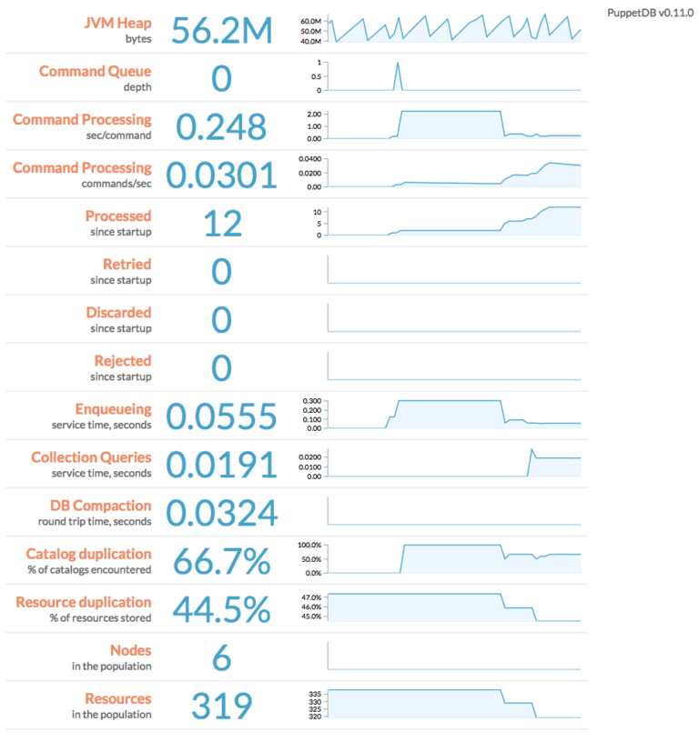
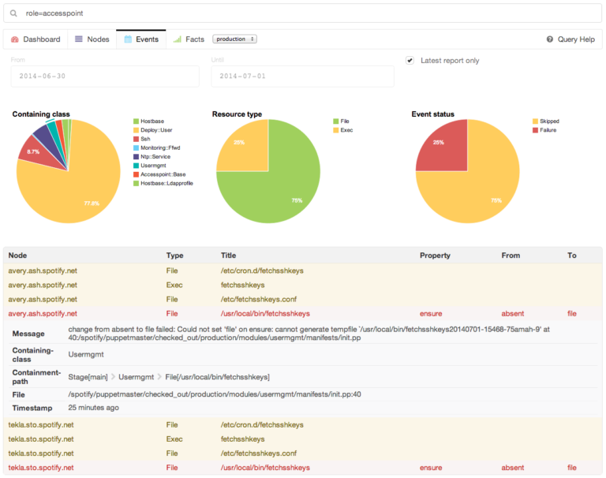
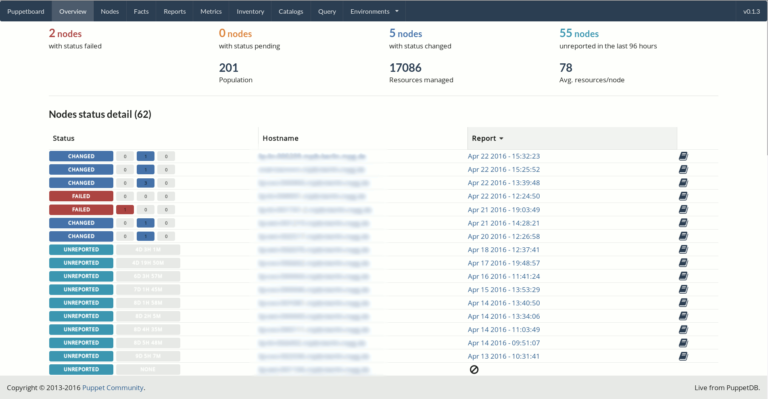

PuppetDB e Dashboards Web
=========================

Nos capítulos `Instalação`_ e `Master / Agent`_, vimos como instalar o puppet-agent e puppetserver. Agora vamos aprender a instalar o PuppetDB, o PuppetExplorer e o PuppetBoard, que oferecem uma interface web que permite acompanhar o que acontece em cada ciclo de operação execultado nas máquinas que possuem o agente instalado.

Os passos de instalação a seguir são executados apenas na máquina **master.domain.com.br** e é assumido que o ``puppet-agent`` e ``puppetserver`` estão instalados.
 
1. Antes de iniciar a instalação do PuppetDB, instale o PostgreSQL 9.5 com os comandos abaixo.

* No CentOS/RedHat 6 64 bits:

::

  # URL_BASE="https://download.postgresql.org/pub/repos/yum/9.5/redhat/rhel-6-x86_64/"
  # rpm -ivh --force $URL_BASE/pgdg-redhat95-9.5-2.noarch.rpm
  # yum -y install postgresql95-server postgresql95-contrib
  # service postgresql-9.5 initdb
  # chkconfig postgresql-9.5 on 

* No CentOS/RedHat 7 64 bits:

::

  # URL_BASE="https://download.postgresql.org/pub/repos/yum/9.5/redhat/rhel-7-x86_64/"
  # rpm -ivh --force $URL_BASE/pgdg-redhat95-9.5-2.noarch.rpm
  # yum -y install postgresql95-server postgresql95-contrib
  # /usr/pgsql-9.5/bin/postgresql95-setup initdb
  # service postgresql-9.5 start
  # chkconfig postgresql-9.5 on 

* No Debian 8:

:: 

  # su -
  # echo "deb http://apt.postgresql.org/pub/repos/apt/ jessie-pgdg main" > \
  /etc/apt/sources.list.d/pgdg.list
  # wget --quiet -O - https://www.postgresql.org/media/keys/ACCC4CF8.asc | apt-key add -
  # apt-get update
  # apt-get -y install postgresql-9.5

* No Ubuntu Server 14.04:

::
 
  # sudo su
  # echo "deb http://apt.postgresql.org/pub/repos/apt/ trusty-pgdg main" > \
  /etc/apt/sources.list.d/pgdg.list
  # wget --quiet -O - https://www.postgresql.org/media/keys/ACCC4CF8.asc | apt-key add -
  # apt-get update
  # apt-get -y install postgresql-9.5

.. raw:: pdf
 
 PageBreak
 
* No Ubuntu Server 16.04:

::

  # echo "deb http://apt.postgresql.org/pub/repos/apt/ xenial-pgdg main" > \
  /etc/apt/sources.list.d/pgdg.list
  # wget --quiet -O - https://www.postgresql.org/media/keys/ACCC4CF8.asc | apt-key add -
  # apt update
  # apt -y install postgresql-9.5

Edite o arquivo ``/etc/postgresql/9.5/main/pg_hba.conf`` (no Debian/Ubuntu) ou ``/var/lib/pgsql/9.5/data/pg_hba.conf`` (no CentOS/Red Hat) e configure o arquivo como mostrado abaixo.

Antes:

.. code-block:: ruby

  local     all       postgres      peer 
  local     all       all          peer 
  host     all      127.0.0.1/32  md5 
  host     all      ::1/128           md5 

Depois:

.. code-block:: ruby

  local     all       postgres         trust 
  local     all       all             trust 
  host    all       127.0.0.1/32     trust 
  host     all      ::1/128               trust 

Outro arquivo que precisa ser editado é o ``/etc/postgresql/9.5/main/postgresql.conf`` (no Debian/Ubuntu) ou ``/var/lib/pgsql/9.5/data/postgresql.conf`` (no CentOS/Red Hat) conforme mostrado abaixo.

Antes:

.. code-block:: ruby

  #listen_addresses = 'localhost'
  port = 5432

Depois:

.. code-block:: ruby
  
  listen_addresses = 'localhost'
  port = 5432

Depois de alterar estes arquivos é preciso reiniciar o PostgreSQL para aplicar as configurações realizadas. Faça isso usando o comando abaixo.

No Debian/Ubuntu:

::

  # service postgresql restart

No CentOS/Red Hat:

::
  
  # service postgresql-9.5 restart

.. raw:: pdf
 
 PageBreak
 
Agora crie o banco de dados e usuário para o puppetdb com a sequencia de comandos abaixo.

::

  su postgres
  createdb puppetdb
  createuser -a -d -E -P puppetdb
  exit

2. Instale o PuppetDB com o comando abaixo.

::

  # puppet resource package puppetdb ensure=latest

3. No servidor PuppetServer, edite o arquivo ``/etc/puppetlabs/puppetdb/conf.d/database.ini`` e altere as seguinte linhas:

.. code-block:: ruby

  [database]
   classname = org.postgresql.Driver
   subprotocol = postgresql
   subname = //localhost:5432/puppetdb
   username = puppetdb
   password = SENHA-DO-USUARIO-PUPPETDB

 
Agora edite o arquivo ``/etc/puppetlabs/puppetdb/conf.d/jetty.ini`` e altere os parâmetros a seguir para deixá-los com esses valores.

.. code-block:: ruby

  [jetty]
   host = 0.0.0.0
   port = 8080
   ssl-host = 0.0.0.0
   ssl-port = 8081

Execute o comando abaixo para gerar os certificados a serem usados pelo PuppetDB e configurar o arquivo ``jetty.ini``.

::

  # puppetdb ssl-setup

Reinicie o PuppetDB com o comando abaixo:

::

  # service puppetdb restart
 
4. Ainda no servidor PuppetServer, instale o pacote ``puppetdb-termini`` com o comando abaixo.

::
  
  # puppet resource package puppetdb-termini ensure=latest

Crie o arquivo ``/etc/puppetlabs/puppet/puppetdb.conf`` e adicione o seguinte conteúdo:

.. code-block:: ruby

  [main]
   server_urls = https://master.domain.com.br:8081

Edite o arquivo ``/etc/puppetlabs/puppet/puppet.conf`` e adicione o seguinte conteúdo na seção ``[master]``.

.. code-block:: ruby
 
  storeconfigs = true
  storeconfigs_backend = puppetdb
  reports = store,puppetdb
  reportstore = /var/log/puppetlabs/puppet

Crie o arquivo ``/etc/puppetlabs/puppet/routes.yaml`` com o seguinte conteúdo:

.. code-block:: ruby

  ---
   master:
     facts:
       terminus: puppetdb
       cache: yaml

Atribua as permissões corretas ao arquivo com o comando abaixo:

::

  # chown -R puppet:puppet `puppet config print confdir`

Reinicie o PuppetServer com o comando abaixo:

::

  # service puppetserver restart

.. aviso::

  |aviso| **Informações sobre o PuppetDB**

  Mais informações sobre a instalação do PuppetDB podem ser encontradas nas páginas: https://docs.puppet.com/puppetdb/latest/configure.html e https://docs.puppet.com/puppetdb/4.1/connect_puppet_master.html

Os arquivos de log do PuppetDB ficam em: ``/var/log/puppetlabs/puppetdb/``

O PuppetDB ficará acessível em: http://master.domain.com.br:8080 ou https://master.domain.com.br:8081

.. aviso::

  |aviso| **Possíveis problemas no acesso ao PuppetDB**
  
  Se não conseguir acessar a interface web do PuppetDB, verifique se há algum firewall bloqueando a porta.

  No CentOS/Red Hat 6, você pode desabilitar o firewall seguindo estas instruções: http://www.cyberciti.biz/faq/fedora-redhat-centos-5-6-disable-firewall

  No CentOS/Red Hat 7, você pode desabilitar o firewall seguindo estas instruções: http://www.liquidweb.com/kb/how-to-stop-and-disable-firewalld-on-centos-7

  Você também pode precisar desabilitar o SELinux no CentOS/RedHat. Siga estas instruções: http://www.revsys.com/writings/quicktips/turn-off-selinux.html ou http://aruljohn.com/info/centos-selinux/

Instalando o PuppetExplorer
---------------------------

Os módulos Puppet de instalação do PuppetExplorer e dependências podem ser instalados no Puppet-Server usando os comandos abaixo.

::

  # puppet module install puppetlabs-apache
  # puppet module install puppetlabs-apt
  # puppet module install spotify-puppetexplorer 

Agora edite o aquivo ``/etc/puppetlabs/code/environments/production/manifests/site.pp`` e adicione o seguinte conteúdo:

.. raw:: pdf
 
 PageBreak
 
.. code-block:: ruby

  node master.domain.com.br {
     class {'::puppetexplorer':
       vhost_options => {
         rewrites  => [ { rewrite_rule => ['^/api/metrics/v1/mbeans/puppetlabs.puppetdb\
         .query.population:type=default,name=(.*)$  https://master.domain.com.br:8081/\
         api/metrics/v1/mbeans/puppetlabs.puppetdb.population:name=$1 [R=301,L]'] } ] }
     }
  }

Agora execute o comando abaixo.

::

  # puppet agent -t
 
Ao final da instalação, o PuppetExplorer ficará acessível em: https://master.domain.com.br

.. aviso::

  |aviso| **Problema no PupppetExplorer**
  
  O módulo de instalação do PuppetExplorer foi declarado passando o recurso ``vhost_options``, afim de corrigir um bug no PuppetExplorer devido a uma atualização realizada no PuppetDB. Veja o report em: https://github.com/spotify/puppetexplorer/issues/49 normalmente, o PuppetExplorer deveria ser instalado apenas usando a declaração abaixo no arquivo site.pp.

::

  node puppetserver.domain.com.br {
     include puppetexplorer
   }

Mais informações sobre o PuppetExplorer podem ser encontradas em:

* https://groups.google.com/forum/#!topic/puppet-users/VDywEgW2Y54
* https://forge.puppet.com/spotify/puppetexplorer
* https://github.com/spotify/puppetexplorer

Instalando o PuppetBoard
------------------------

Se você não quiser usar o PuppetExplorer, pode usar o PuppetBoard.

Os módulos Puppet de instalação do PuppetBoard e dependências podem ser instalados no Puppet-Server usando os comandos abaixo.

::

  # puppet module install puppetlabs-apache
  # puppet module install puppetlabs-apt
  # puppet module install puppet-puppetboard 

Agora edite o aquivo ``/etc/puppetlabs/code/environments/production/manifests/site.pp`` e adicione o seguinte conteúdo:

.. code-block:: ruby

  node puppetserver.domain.com.br {
     class {'apache': }
     # Configure Apache on this server
     class { 'apache::mod::wsgi': }
     # Configure Puppetboard
     class { 'puppetboard':
       manage_git        => 'latest',
       manage_virtualenv => 'latest',
       reports_count      => 50
     }
     # Configure Access Puppetboard
     class { 'puppetboard::apache::vhost':
     vhost_name => 'master.domain.com.br',
     port       => 443,
     ssl        => true,
     }
  }

Agora execute o comando abaixo.

::

  # puppet agent -t

Ao final da instalação, o PuppetBoard ficará acessível em: https://master.domain.com.br

.. raw:: pdf
 
 PageBreak

É possível que você enfrente o problema abaixo na instalação do PuppetBoard no CentOS/Red Hat 7.

Erro:

.. code-block:: ruby

  Execution of '/usr/bin/rpm -e python-devel-2.7.5-34.el7.x86_64' returned 1:
   error: Failed dependencies:
  python2-devel is needed by (installed) python-virtualenv-1.10.1-2.el7.noarch
  Error: /Stage[main]/Python::Install/Package[python-dev]/ensure: change from 
   2.7.5-34.el7 to absent failed: Execution of '/usr/bin/rpm -e 
   python-devel-2.7.5-34.el7.x86_64' returned 1: error: Failed  dependencies:
  python2-devel is needed by (installed) python-virtualenv-1.10.1-2.el7.noarch
 
Solução:

Edite o arquivo ``/etc/puppetlabs/code/environments/production/modules/python/manifests/install.pp``. Altere todas as ocorrências de:
 
.. code-block:: ruby

  package { 'python-dev':
  ensure => $dev_ensure,
  name => $pythondev,
  }

Para:

.. code-block:: ruby

  package { 'python-dev':
  ensure => present,
  #ensure => $dev_ensure,
  name => $pythondev,
  }

Depois execute:

::

  # puppet agent -t

Mais informações sobre o PuppetBoard podem ser encontradas em: https://forge.puppet.com/puppet/puppetboard

Configurando os Agentes Puppet
------------------------------

Em cada máquina que executa o Puppet-Agent, adicione no arquivo ``/etc/puppetlabs/puppet/puppet.conf`` o seguinte conteúdo:

.. code-block:: ruby

  [agent]
   report = true

Reinicie o Puppet-Agent com o comando abaixo:

::
  
  # service puppet restart
