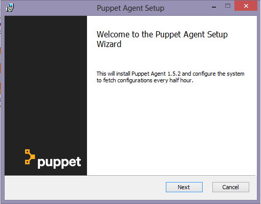
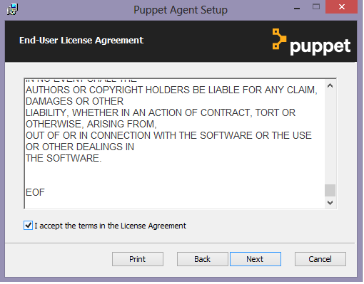
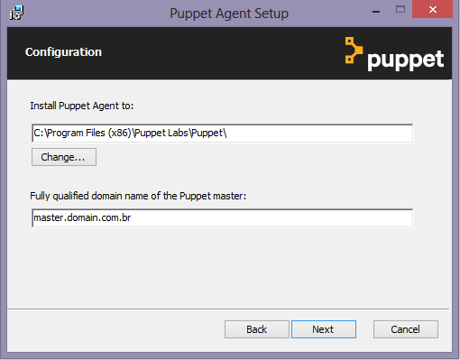
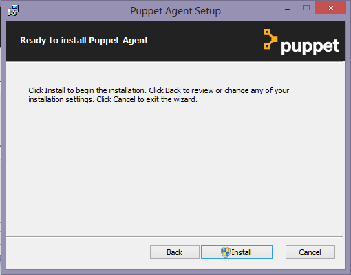

Puppet no Windows
=================

O suporte a Windows no Puppet vem melhorando a cada nova versão. Mas não é possível hospedar o Puppet Server no Windows, sendo somente o agente suportado.

Praticamente onde é possível criar compatibilidade, os resources do Puppet suportam Windows normalmente. Em alguns casos são necessários certos cuidados devido as diferenças semânticas entre sistemas Unix-like e Windows.

Para obter detalhes sobre a instalação do Puppet Agent no Windows acesse: https://docs.puppet.com/puppet/latest/reference/install_windows.html

Prática: Instalação
-------------------

Para a realização dessa prática é necessário você instalar uma terceira máquina com o Windows 7 e aqui chamaremos de **win7.domain.com.br**. Também precisaremos usar a máquina **master.domain.com.br**.

1. Faça login na máquina **win7.domain.com.br**. Baixe o instalado mais novo do Puppet-Agent para Windows em: 

* https://downloads.puppetlabs.com/windows/puppet-agent-x64-latest.msi (Windows 64 bits)
* https://downloads.puppetlabs.com/windows/puppet-agent-x86-latest.msi (Windows 32 bits)

2. Execute o instalador do Puppet-Agent. Aparecerão as telas a seguir. Em uma delas será perguntando qual é o servidor master, preencha com **master.domain.com.br**.

  
3. Pare o serviço **Puppet**, pois realizaremos manualmente nossas atividades:

::

  sc stop puppet

.. raw:: pdf

  PageBreak

5. Após a instalação, como o serviço **Puppet**  estava em execução, um certificado já foi solicitado ao master. Como de praxe, assine o certificado:

::

  # puppet cert list
    "win7.domain.com.br" (SHA256) EE:58:97:E3:6F:64:15:DF:68:A4:21:DA:A3:E2:81:43:3F: ...
  
  # puppet cert sign win7.domain.com.br
  Signed certificate request for win7.domain.com.br
  Removing file Puppet::SSL::CertificateRequest win7.domain.com.br at \
            '/var/lib/puppet/ssl/ca/requests/win7.domain.com.br.pem'

6. Abra um prompt de comando como Administrador, conforme ilustra a figura abaixo:

.. image:: images/windows-run-as-admin.png

7. Execute o agente da mesma maneira que no GNU/Linux.

::

  puppet agent -t

.. nota::

  |nota| **Privilégios**
  
  No Windows, o Puppet precisa de privilégios elevados para funcionar corretamente, afinal ele precisa configurar o sistema.
  
  O serviço do Puppet é executado com privilégio **LocalSystem**, ou seja, sempre com privilégios elevados.
  
  Quando usar a linha de comando, é sempre necessário utilizar o Puppet com privilégios elevados.

Prática: resources para Windows
-------------------------------

Essa prática é realizada em **win7.domain.com.br** e **master.domain.com.br**.

1. Na máquina win7.domain.com.br, baixe o pacote http://www.7-zip.org/a/7z1602.exe e copie para c:\. Declare o seguinte no arquivo ``/etc/puppetlabs/code/environments/production/manifests/site.pp``:

::

  node win7.domain.com.br {
    package {'7-Zip 16.02':
      ensure => 'installed',
      source => 'c:\Users\Puppet\Downloads\7z1602.exe',
      install_options => ['/q', { 'INSTALLDIR' => 'C:\Program Files\7-Zip' } ],
    }
  }  

2. Aplique o agente (lembre-se de usar um prompt com privilégios elevados)

::

  puppet agent -t

.. dica::

  |dica| **Título do resource package**
  
  O título do resource package precisa ser igual a propriedade *DisplayName* utilizada no registro do Windows para instalação de um pacote MSI. Caso o título seja diferente, o Puppet executará a instalação em todas as execuções.

3. Veja que o 7-Zip foi instalado:

.. image:: images/windows-7zip.png

.. raw:: pdf

  PageBreak

4. Agora vamos configurar um serviço. Declare o seguinte no ``site.pp`` para o node **win7.domain.com.br**:

::

  service {'Audiosrv':
    ensure => 'stopped',
    enable => false,
  }

5. Note que o serviço está em execução (terminal com privilégio regular):

::

  C:\> sc query audiosrv
   
  SERVICE_NAME: audiosrv
          TYPE               : 20  WIN32_SHARE_PROCESS
          STATE              : 4  RUNNING
                                  (STOPPABLE, NOT_PAUSABLE, IGNORES_SHUTDOWN)
          WIN32_EXIT_CODE    : 0  (0x0)
          SERVICE_EXIT_CODE  : 0  (0x0)
          CHECKPOINT         : 0x0
          WAIT_HINT          : 0x0

6. Aplique o agente (lembre-se de usar um prompt com privilégios elevados)

::

  puppet agent -t

7. Veja que o serviço Windows Audio foi parado e desativado.

::

  C:\>sc query audiosrv
   
  SERVICE_NAME: audiosrv
          TYPE               : 20  WIN32_SHARE_PROCESS
          STATE              : 1  STOPPED
          WIN32_EXIT_CODE    : 0  (0x0)
          SERVICE_EXIT_CODE  : 0  (0x0)
          CHECKPOINT         : 0x0
          WAIT_HINT          : 0x0

Para mais detalhes sobre as diferenças na declaração dos resources no Windows: http://docs.puppetlabs.com/windows/writing.html

.. raw:: pdf

  PageBreak

Prática: manipulando o registro
-------------------------------

Essa prática é realizada em **win7.domain.com.br** e **master.domain.com.br**.

1. Instalando o módulo **puppetlabs-registry** em **master.domain.com.br**:

::

  # puppet module install puppetlabs/registry
  Preparing to install into /etc/puppetlabs/code/environments/production/modules ...
  Downloading from https://forge.puppetlabs.com ...
  Installing -- do not interrupt ...
  /etc/puppetlabs/code/environments/production/modules
  |-- puppetlabs-registry (v0.1.1)

2. Execute o agente no Windows para instalação do módulo **puppetlabs-registry** (lembre-se de abrir o terminal do Puppet como *Administrator*):

::

  # puppet agent -t

3. Declare uma chave de registro no nosso manifest:

::

  node 'win7.domain.com.br' {
    registry::value { 'Adware':
      key   => 'HKLM\Software\Microsoft\Windows\CurrentVersion\Run',
      value => 'Adware',
      data  => 'c:\adware\adware.exe'
    }
  }

4. Execute o agente no Windows para que a chave no registro seja criada (lembre-se de abrir o terminal do Puppet como *Administrator*):

::

  # puppet agent -t

5. A chave foi criada.

.. image:: images/windows-regedit.png
  :scale: 80%

